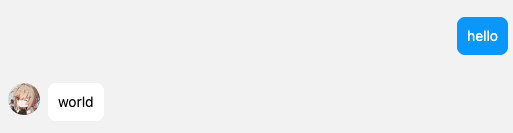

RUNBOT
======

Rust one bot v11 协议 （ 正向ws / 反向ws ）

- [x] 事件
  - [x] 监听元事件
  - [x] 监听私聊、组群消息
  - [x] 监听通知（群增减员、拍一拍、手气最佳等）
  - [ ] 监听请求（好友请求、进群请求）
- [x] 操作
  - [x] 发送文本、图片、自定义onebot11JSON消息 到 私聊、组群 (并异步取得发送结果以及消息ID)
  - [x] 撤回消息
  - [ ] 获取消息
  - [ ] 获取合并转发消息
  - [ ] 发送好友赞
  - [ ] 群组踢人
  - [ ] ....
- [ ] 拓展
  - [ ] 命令匹配、命令宏


## 使用

您可以clone项目并运行 `cargo run --example client`  运行正向WS事例
您可以clone项目并运行 `cargo run --example server`  运行反向WS事例


#### 1. 运行和回复消息

```toml
# 使用github版本
runbot = { git = "https://github.com/niuhuan/runbot.git" }
# 使用crates.io版本
runbot = "0"
```

```rust
use std::sync::Arc;
use anyhow::Result;
use runbot::prelude::*;

#[tokio::main]
async fn main() {
    // 打印日志
    tracing_subscriber::fmt()
        .with_max_level(tracing::Level::DEBUG)
        .init();
    // 生成一个bot上下文
    let bot_ctx = BotContextBuilder::new()
        // 声明链接地址
        .url("ws://localhost:3001")
        // 注册消息处理器 (UPPER_SNAKE)
        .add_message_processor(DEMO_PROCESSOR_FN)
        .build()
        .unwrap();
    // loop_client 或者 spawn loop_client
    loop_client(bot_ctx).await;
}

// 声明一个处理器, 当收到消息后被调用
// 参数固定为 Arc<BotContext>，Arc<Message>,
// 返回值为 Result<bool>, 当有一个处理器返回Ok(true)或Err()时将会停止递归
// 
// 此demo为收到好友消息，消息为`hello`时，自动回复`world`
#[message_processor]
pub async fn demo_processor_fn(bot_ctx: Arc<BotContext>, message: Arc<Message>) -> Result<bool> {
    if message.raw_message.eq("hello") {
        if let MessageSubType::Friend = message.sub_type {
            bot_ctx.send_private_message(message.user_id, "world".to_string()).await?;
        }
    }
    Ok(true)
}
```




#### 监听事件

```rust
#[notice_processor]
pub async fn demo_notice_processor_fn(
    bot_ctx: Arc<BotContext>,
    notice: Arc<Notice>,
) -> Result<bool>
```

#### 消息链 (发送图片)

```rust
let mut chain = vec![];
chain.push(MessageText::new("this").into());
chain.push("is face".into());
chain.push(
    MessageFace {
        id: "187".to_string(),
        sub_type: 1,
    }
    .into(),
);
bot_ctx.send_private_message(message.user_id, chain).await?;
let exec_path = std::env::current_dir().unwrap().join("target/test.png");
bot_ctx.send_private_message(message.user_id, vec![
    MessageImage::new(exec_path.to_str().unwrap()).into(),
]).await?;
```

#### 获取Onebot11的异步Reponse 

```rust
bot_ctx.send_private_message(12345, "hello").await?;
let async_response = bot_ctx.send_private_message(message.user_id, chain).await?;
let msg_id = async_response.wait_response(Duration::from_secs(3)).await?.message_id;
bot_ctx.delete_msg(msg_id).await?;
```

#### 反向WS

```rust
async fn main() {
    tracing_subscriber::fmt()
        .with_max_level(tracing::Level::DEBUG)
        .init();
    let server = BotServerBuilder::new()
        .bind("0.0.0.0:3131")
        .add_message_processor(DEMO_PROCESSOR_FN)
        .build()
        .unwrap();
    loop_server(server).await.unwrap();
}
```
